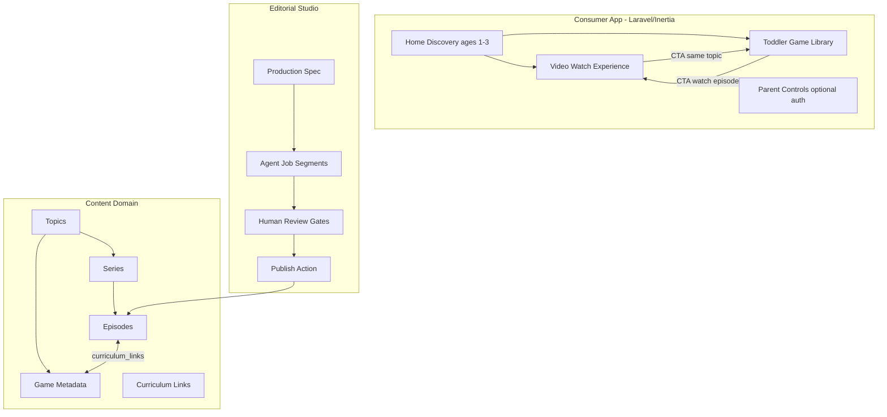
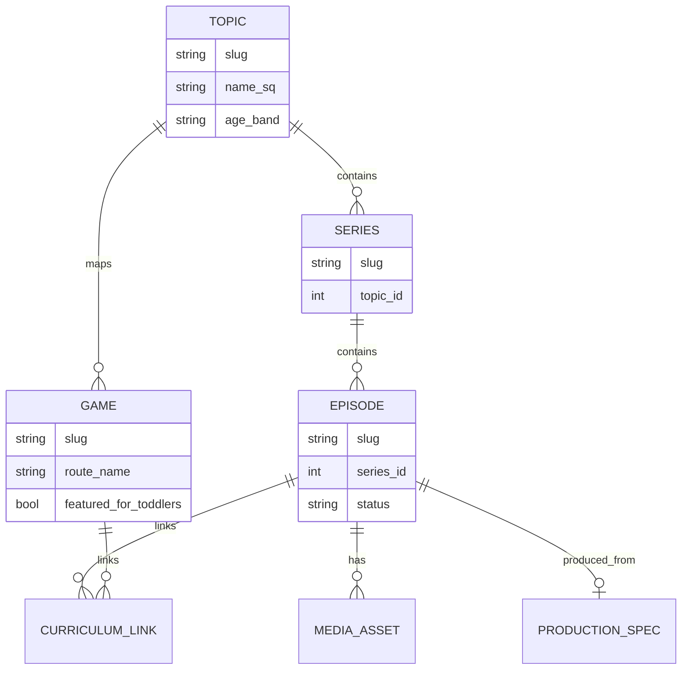
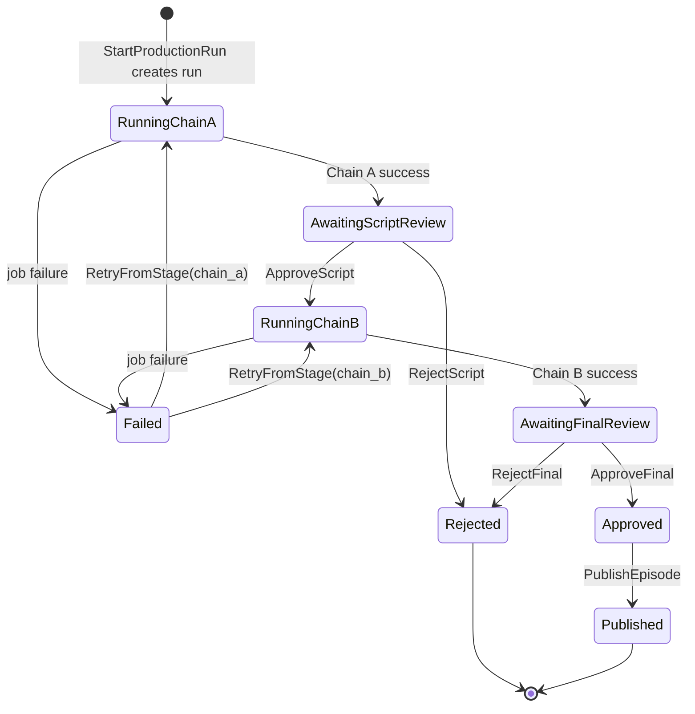
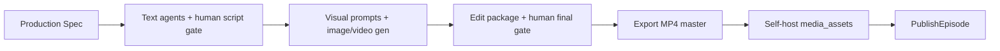

# PlayZone Kids: Toddler Video + Games Platform Evolution

| Field | Value |
|-------|--------|
| **Document title** | PlayZone Kids — Educational Platform for Ages 1–3 (Albanian-first) |
| **Author** | Systems Architecture (TBD) |
| **Date** | 2026-08-05 |
| **Status** | **Ready for implementation** (product decisions locked 2026-08-05) |
| **Codebase** | `/home/agent/Projects/my-project` (Laravel 13 + Inertia React 3) |
| **Brand** | PlayZone Kids (`APP_NAME`, `resources/js/pages/welcome.tsx`) |

---

## Overview

PlayZone Kids today is a small **English-only mini-game hub**: six client-side Inertia games under `routes/web.php` (`games/*`) and `resources/js/pages/games/*`, wrapped by `resources/js/components/games/game-shell.tsx`, with Fortify auth for adults but **no content models, no media, no localization, and no curriculum**. Age badges on the home page already skew **3–6+** (Color Pop is the only “Ages 3+” title). There is **no `lang/` directory** yet; PR 1 creates it.

This design evolves the same Laravel application into the **primary home for educational videos and age-appropriate games for children ages 1–3**, with primary focus on **Albanian-speaking toddlers**. Videos and games share a **curriculum taxonomy** (topics → series → episodes ↔ games). An editorial **Production Spec** domain object drives a **multi-agent, Laravel-job pipeline** with **two human gates** that **resume via separate job chains** (not one continuous `Bus::chain`). Delivery is **incremental**: product pivot and manual catalog first; production automation later. Free play without login remains non-negotiable; accounts are **parent-only**.

**Locked product decisions (final):**

1. **Media:** First public pilot is **self-hosted progressive MP4 + HTML5 player only**. YouTube/Vimeo are optional later fallbacks, not MVP.
2. **Pilot visuals:** Prefer **stylized animated character** (AI production package + image/video gen + edit package), not live human presenter film.
3. **Dialect:** **Standard literary Albanian** (Tosk-based standard) for all scripts, UI chrome review, and agent prompts.

**Honest age framing for games (v1):** Videos target **1–3** with co-viewing. Interactive games that require color-name matching (Color Pop) are marketed **ages 2–3** with “grown-up helps” for 12–24 months. A true **ages 1–2 cause-effect game (Touch & Tap)** is a **Phase 2 must-have**, not optional.

---

## Background & Motivation

### Current state (as implemented)

| Area | Reality in repo |
|------|-----------------|
| Stack | PHP ^8.4 (runtime often 8.5.x), Laravel ^13.7, Inertia React 3, Fortify, Wayfinder, Tailwind 4, Pest 4, bun |
| Entry | `Route::inertia('/', 'welcome')` — game cards only (`resources/js/pages/welcome.tsx`) |
| Games | `memory`, `tic-tac-toe`, `whack-a-mole`, `color-pop`, `rock-paper-scissors`, `number-quest` — pure React, no Eloquent |
| Shared UI | `GameShell` — English chrome (“All Games”, “Back to all games”) |
| Auth | Fortify + passkeys; `User` model only; games **public**. `MustVerifyEmail` is **commented out** on `User` though `Features::emailVerification()` is enabled in Fortify — `verified` middleware does **not** enforce until the interface is implemented |
| Data | SQLite default; `users`, cache, jobs, sessions, passkeys, 2FA — **no content tables** |
| Queue | `QUEUE_CONNECTION=database`; `retry_after` default **90s** in `config/queue.php` |
| Locale | `APP_LOCALE=en`; **no `lang/` directory**; no Inertia locale sharing |
| Patterns | Prefer `app/Actions` with single `handle()` (see `AGENTS.md`); only Fortify actions exist today |
| Enums | `app/Enums/` exists but is empty — new domain enums land there |
| Appearance cookie pattern | `use-appearance.tsx` writes `document.cookie` + `localStorage`; `bootstrap/app.php` encrypts cookies **except** `appearance`, `sidebar_state` |
| Tests | `tests/Feature/GamesTest.php` asserts home + all six game Inertia components |

### Pain points

1. **Age mismatch**: Product vision is 1–3; catalog labels and cognitive load target preschool/early elementary.
2. **Language mismatch**: All copy is English; Albanian toddler content cannot ship without locale + content model work.
3. **No video surface**: No episode, media asset, or watch experience.
4. **No curriculum**: Games are isolated routes; cannot link “watch Ngjyrat → play Color Pop.”
5. **No production system**: Leadership wants AI-assisted original Albanian educational video packages; nothing exists to store specs, runs, or review gates.
6. **COPPA / privacy readiness**: Auth exists for parents, but product messaging and privacy posture are not yet formalized for a kids media brand.

### Why evolve in-place

Greenfield rewrite would discard working Fortify auth, Inertia layouts, Tailwind design language, Action conventions, and the games already closest to toddler UX (especially Color Pop). Incremental evolution keeps the starter-kit structure and ships value phase-by-phase.

---

## Goals & Non-Goals

### Goals

1. Position PlayZone Kids as **home for toddler videos + games** (ages 1–3 co-viewing videos; games honest age bands — see Key Decision 17).
2. Ship a **discoverable catalog** and **toddler-optimized HTML5 watch page** only after a **minimum privacy bar** (policy page, parent-only copy, no analytics; self-hosted media primary).
3. **Retarget the game library**: Touch & Tap (1–2) + Color Pop toddler mode (2–3); demote strategy/math games.
4. Introduce a **curriculum taxonomy** linking topics, episodes, and games.
5. Define a **Production Spec** (versioned JSON + schema file) and Laravel-orchestrated multi-agent pipeline with **mandatory human review gates** and **resume-after-approval** orchestration.
6. Pilot end-to-end episode: **Colors (Ngjyrat)** — 10–15 minutes, original Albanian dialogue/songs — **AI production package + animated character visuals**, published as **self-hosted MP4**.
7. Preserve **anonymous free play/watch**; optional parent accounts later for favorites/progress.
8. Meet **child-privacy baseline**: no ads, no child accounts, no social, no child tracking; **no third-party video embed** for pilot.

### Non-Goals

- Full CMS marketplace or third-party creator uploads (v1 is first-party editorial only).
- Real-time multiplayer or kid-to-kid social features.
- Live human presenter filming as the pilot path (animated character is primary; human film remains a future option only).
- Perfect photoreal “person speaking Albanian to camera” generative video.
- YouTube/Vimeo as pilot delivery (optional later fallbacks only).
- CrewAI / LangGraph as core orchestration.
- Replacing Fortify or rewriting the frontend stack.
- Offline-first PWA as a Phase 0–2 requirement.
- Paid subscriptions / monetization architecture.

---

## Proposed Design

### 1. Product architecture

#### Platform concept



- **Videos** teach one concept via a **warm stylized animated character** (or later live presenter), with pauses, songs, movement (ages 1–3 co-viewing).
- **Games** reinforce vocabulary/motor skills; marketed age bands must be honest (see §2 Game library).
- **Linking**: after an episode, “Luaj tani” opens the matching game; games show “Shiko videon” when a published episode exists.

#### Parent-facing vs toddler-facing UX

| Surface | Who operates | UX rules |
|---------|--------------|----------|
| Home discovery | Parent (co-viewing default) | Albanian primary labels; EN toggle for parent chrome; large cards; co-play note for under-2s |
| Watch page | Parent starts; toddler watches | Giant play/pause; parent drawer for volume/captions; no related autoplay rabbit holes |
| Games | Toddler taps; parent nearby | Minimal text; emoji cues; Albanian labels on toddler games |
| Settings / auth / studio | Parent / editor only | **English until Phase 5** (Key Decision 16); never on toddler critical path |

**Default mental model**: co-viewing. Device is parent-operated; child has no account.

#### Locale strategy (implementable)

| Layer | Strategy |
|-------|----------|
| Content display | Catalog titles/summaries from DB `*_sq` / `*_en` columns based on active locale |
| Consumer chrome | `lang/sq.json` + `lang/en.json` (PR 1 **creates** `lang/` — it does not exist today) |
| Auth / settings / Fortify | **Remain English** until Phase 5 (avoid incomplete auth translations) |
| Episode dialogue | Content tables / production artifacts — **not** lang files |
| Dialect for scripts | **Decided:** standard literary Albanian (Tosk-based standard). All agent prompts, scripts, and native-speaker review use this dialect. |

**Locale switch mechanism** (mirror appearance):

1. Add `locale` to `$middleware->encryptCookies(except: [...])` in `bootstrap/app.php` alongside `appearance`, `sidebar_state`.
2. Client: `useLocale` hook writes `document.cookie = 'locale=sq;path=/;max-age=…;SameSite=Lax'` (same pattern as `setCookie` in `resources/js/hooks/use-appearance.tsx`) and optionally `localStorage`.
3. Server: `App\Http\Middleware\SetLocale` reads cookie, allowlists `sq|en`, calls `app()->setLocale()`, falls back to `config('app.locale')`.
4. `HandleInertiaRequests::share()` adds `locale`, `availableLocales: ['sq','en']`, and a **small** `translations` map for chrome keys used on home/GameShell (or rely on server-rendered strings via props).
5. Do **not** set `APP_LOCALE=sq` until PR 1 lands minimal `lang/sq.json` covering consumer chrome; leave Fortify/validation on English fallback.

**PR 1 chrome string inventory (minimal):**

| Key | EN | SQ |
|-----|----|----|
| `app.tagline` | Videos & games for little ones | Video dhe lojëra për fëmijët e vegjël |
| `home.hero_title` | Watch, play, learn together | Shiko, luaj, mëso bashkë |
| `home.videos` | Videos | Videot |
| `home.toddler_games` | Games for little ones | Lojëra për fëmijët e vegjël |
| `home.more_games` | More games | Më shumë lojëra |
| `home.coplay_note` | Grown-ups: play together with under-2s | Prindër: luani bashkë me fëmijët nën 2 vjeç |
| `games.back` | All games | Të gjitha lojërat |
| `games.home` | Home | Kreu |
| `videos.play` | Play | Luaj |
| `videos.watch` | Watch video | Shiko videon |
| `cta.play_now` | Play now | Luaj tani |
| `nav.login` / `nav.register` | Log in / Join free | Hyr / Regjistrohu falas |

**Color labels (toddler games)** — fixed adjective forms for UI (gender agreement simplified for toddlers; native review in PR 6):

| Color | UI label (SQ) | Notes |
|-------|---------------|-------|
| Red | E kuqe | Feminine form common in toddler materials |
| Blue | E kaltër | |
| Yellow | E verdhë | |
| Green | E gjelbër | |

Native speaker reviews **UI chrome and game labels**, not only scripts.

#### Content taxonomy



**Skills**: JSON arrays e.g. `language`, `colors`, `motor`, `attention`, `music`, `body_parts`.

**Age bands** (`App\Enums\AgeBand`): `OneToTwo` (`1-2`), `TwoToThree` (`2-3`), `OneToThree` (`1-3`), `ThreeToFive` (`3-5`), `FivePlus` (`5+`).

**Initial pilot topics (5):** Ngjyrat, Kafshët, Pjesët e trupit, Përshëndetjet, Fjalët e para.

---

### 2. Consumer product (Laravel / Inertia)

#### Information architecture & routes

```php
// Public (Phase 0–1+)
Route::get('/', [HomeController::class, 'show'])->name('home');
Route::get('/privacy', [PrivacyController::class, 'show'])->name('privacy'); // required with videos
Route::get('/videos', [EpisodeController::class, 'index'])->name('videos.index');
Route::get('/videos/{episode:slug}', [EpisodeController::class, 'show'])->name('videos.show');
Route::get('/topics/{topic:slug}', [TopicController::class, 'show'])->name('topics.show');

// Existing games (unchanged URLs)
Route::prefix('games')->name('games.')->group(/* … */);

// Parent optional (Phase 5) — see email verification decision below
Route::middleware(['auth', 'verified'])->prefix('parent')->name('parent.')->group(/* favorites, progress */);

// Studio (Phase 3+) — auth + manage-content; email verification required for editors
Route::middleware(['auth', 'verified', 'can:manage-content'])->prefix('studio')->name('studio.')->group(/* … */);
```

**Email verification decision (Issue 5):** In **PR 8**, implement `MustVerifyEmail` on `User` (uncomment / implement interface) so Fortify’s existing verification feature and `verified` middleware actually enforce. Studio and parent data routes use `verified`. Public games/videos stay open. Until PR 8 merges, do **not** put parent PII routes behind a false sense of `verified`.

Controllers stay thin; business logic in `app/Actions/*`.

#### End-to-end Action conventions (Issue 15)

**Public show episode** — controller → authorize (public) → Action → Inertia:

```php
// app/Http/Controllers/EpisodeController.php
public function show(Episode $episode): Response
{
    abort_unless($episode->status === EpisodeStatus::Published, 404);

    $view = app(ShowPublishedEpisode::class)->handle($episode);

    return Inertia::render('videos/show', $view);
}

// app/Actions/Episodes/ShowPublishedEpisode.php
final readonly class ShowPublishedEpisode
{
    public function handle(Episode $episode): array
    {
        $episode->load(['series.topic', 'mediaAssets', 'curriculumLinks.game']);

        return [
            'episode' => EpisodeShowData::from($episode),
            'linkedGames' => /* … */,
            'nextEpisode' => /* … */,
        ];
    }
}
```

**Start production run** — authorize → rate limit → Action → jobs:

```php
// app/Http/Controllers/Studio/ProductionRunController.php
public function store(ProductionSpec $spec, Request $request): RedirectResponse
{
    $this->authorize('manage-content');

    $run = app(StartProductionRun::class)->handle($spec, $request->user());

    return redirect()->route('studio.runs.show', $run);
}

// app/Actions/Production/StartProductionRun.php
final readonly class StartProductionRun
{
    public function __construct(private XaiClient $xai) {} // injected but unused here; jobs resolve client

    public function handle(ProductionSpec $spec, User $editor): ProductionRun
    {
        // RateLimiter + create run + dispatch Chain A only (see §3)
    }
}
```

**Rule:** Jobs call Actions; jobs do not embed business logic. Multi-model writes (publish + media attach) use `DB::transaction()` inside the Action.

#### Home (Phase 0–1)

Rewrite `resources/js/pages/welcome.tsx` (or `home.tsx` + controller):

1. Hero: Albanian-first value prop + co-play note for under-2s.
2. Featured videos row (empty until Phase 1; gated by `config('features.videos')`).
3. Toddler games: Touch & Tap (Phase 2) + Color Pop.
4. More games collapsible for legacy 4+ titles.
5. Parent links secondary; privacy link in footer.

**HomeProps shape is fixed from PR 2** so PR 5 is a data-source swap only:

```ts
type HomeProps = {
  featuredEpisodes: EpisodeCard[]; // [] until videos live
  toddlerGames: GameCard[];
  moreGames: GameCard[];
  locale: 'sq' | 'en';
  features: { videos: boolean; studio: boolean; toddlerHome: boolean };
};
```

PR 2 may hard-code `toddlerGames` / `moreGames` arrays **using this shape**; PR 5 replaces with Eloquent queries without changing the page contract.

#### Watch experience (Phase 1)

Page: `resources/js/pages/videos/show.tsx`.

| Requirement | Design |
|-------------|--------|
| Touch targets | ≥ 48–64px; play/pause full-width bar |
| Clutter | No sidebars, comments, or related autoplay |
| Captions | SQ subtitles available; parent toggle |
| Parent controls | Volume, fullscreen, captions, leave |
| Autoplay | **No** autoplay with sound on load |
| Privacy minimum | Policy linked; allowlisted embed only |

#### Media delivery — self-host primary (product decision locked)

**Pilot / MVP: self-hosted progressive MP4 + HTML5 `<video>` only.**  
YouTube and Vimeo are **optional later fallbacks**, not the first public pilot path. This removes third-party embed tracking for ages 1–3 and keeps playback under app control.

| Option | Verdict |
|--------|---------|
| **Self-host (public disk or S3)** | **Primary / pilot default** — editor upload or pipeline export → `media_assets.provider = self` |
| YouTube embed | **Deferred optional** — only if product later chooses distribution/SEO; not required to ship pilot |
| Vimeo privacy | **Deferred optional** (former Alternative G) — same schema, not pilot |

**`Html5Player` component contract (pilot):**

```ts
// resources/js/components/videos/html5-player.tsx
type Html5PlayerProps = {
  src: string;          // signed or public storage URL from media_assets
  poster?: string;      // thumbnail URL
  captionsSrc?: string; // VTT (Albanian)
  title: string;
};

// <video controls playsInline preload="metadata" poster={poster}>
//   <source src={src} type="video/mp4" />
//   {captionsSrc && <track kind="captions" srcLang="sq" src={captionsSrc} default />}
// </video>
// No autoplay with sound. Huge custom play overlay OK; native controls acceptable for v1.
// Touch targets: parent bar for leave / volume / captions toggle alongside native controls.
```

**Upload / storage (`config/media.php` + filesystems):**

```php
// config/media.php
return [
    'default_provider' => 'self',
    'self' => [
        'disk' => env('MEDIA_DISK', 'public'), // or s3 in production
        'max_upload_mb' => 512,
        'allowed_mimes' => ['video/mp4', 'video/webm'],
        'path_prefix' => 'episodes',
    ],
    // Optional later — not used for pilot publish
    'embed_providers' => [
        // 'youtube' / 'vimeo' may be added when product enables fallbacks
    ],
];
```

- Editor Action `UploadEpisodeVideo` (auth + `manage-content`): store file on `MEDIA_DISK`, create `media_assets` row (`kind=video_master`, `provider=self`, `disk`, `path`, `mime_type`, `size_bytes`).
- Optional: upload VTT as `kind=subtitle`, language `sq`.
- `ResolveEpisodePlayback` for pilot returns only `provider=self` playback URLs (signed if private disk; public `/storage/...` if `public` disk + `php artisan storage:link`).
- **CSP (PR 4 / PR 17):** `media-src 'self' https:` (or bucket host); **no** `frame-src` YouTube required for pilot. If embed fallbacks ship later, add allowlisted `frame-src` then.

**Optional later: `YoutubeEmbed`** — keep design notes deferred; implement only if product enables YouTube distribution. Do **not** block pilot on embed code.

**Pilot publish checklist (self-host):**

1. Approved production package (script + final gates) **or** manual Spec path (Alternative F).
2. Exported animation master as H.264 MP4 (10–15 min target), reasonable bitrate for mobile.
3. Upload via studio or attach path from pipeline export.
4. Albanian VTT captions attached when available.
5. Thumbnail still uploaded.
6. `PublishEpisode` only if `video_master` self asset exists and episode fields valid.

#### Game library retargeting (Issue 11)

| Game | Current | v1 decision |
|------|---------|-------------|
| **Touch & Tap** (new) | — | **Phase 2 must-have**; ages **1–2**; pure cause-effect (big shape appears/sounds on tap); co-play default |
| Color Pop | 3+, lives, 6 colors | **Toddler mode ages 2–3**: 4 colors, Albanian labels, no hard game-over (soft feedback), huge targets; badge “2–3 vjeç · me prind” |
| Memory | 4+ | Demote or 4-pair animal mode under “More” |
| Whack-a-Mole | 4+ | Demote unless slow mode later |
| Tic-Tac-Toe / RPS / Number Quest | 5–6+ | Demote to “More games” |

**Home marketing honesty:** Hero says ages 1–3 for **videos**; games section labels per-game age bands. Footer note: grown-ups play with under-2s.

Keep routes stable for existing six games (`GamesTest` green). New Touch & Tap route: `games.touch-and-tap` + Pest case.

#### Progress / favorites (Phase 5)

- Free play without login always.
- Authenticated **verified parent** may favorite / track progress.
- Child profiles = parent-managed labels only (no child credentials).

#### COPPA / child privacy — minimum bar before public videos (Issue 3)

| Rule | Implementation | When |
|------|----------------|------|
| No ads | No ad SDKs | Always |
| No child accounts | Registration: “Parent / caregiver account only” | PR 4 / PR 8 |
| No child tracking | No product analytics on toddler events | Always |
| No social | No comments, chat, UGC | Always |
| Privacy policy | Public `/privacy` page (draft legal OK initially; product owner owns counsel review) | **PR 4a — required before `FEATURE_VIDEOS` public** |
| First-party media | Self-hosted video only for pilot; no third-party player embed | **PR 4 + PR 4b** |
| Parent gate for PII | Favorites require `auth` + `verified` | Phase 5 / PR 8+ |
| Third parties | Pilot avoids video processors (YT/Vimeo); disclose any later embeds if added | Open Question 1 ownership |

**Sequencing:** PR 4 (catalog + HTML5 watch) and **PR 4b (self-host upload)** require **PR 4a** privacy minimum before `FEATURE_VIDEOS` is enabled publicly.

**Jurisdiction note:** COPPA applies if US-directed; Albania/EU parents may still trigger GDPR-K / local rules. **Privacy policy owner** = product leadership + legal counsel (not engineering alone). Engineering ships technical controls; counsel approves public language before marketing launch.

---

### 3. Content production pipeline

#### Production Spec as first-class domain object

Versioned structured JSON in `production_specs.spec`. **Validation source of truth** (Issue 23):

- Land **`storage/schemas/production_spec.v1.json`** in the same PR as Spec CRUD (PR 9b).
- PHP value object / DTO `App\Production\ProductionSpecData` maps validated payload.
- `ValidateProductionSpec` Action: decode JSON → schema validate (e.g. `justinrainbow/json-schema` **only if justified**; otherwise strict PHP validation of required keys/types matching the schema file) → reject invalid specs.
- Agents receive **only** validated specs. Breaking changes bump `spec.version` and schema file (`v2.json`).

Sample (pedagogy unchanged — abbreviated fields as before): episode_slug, language `sq`, age_band, learning_goals, vocabulary with props, structure blocks, principles (2–6 words, 3–5s pauses, etc.), outputs_required list.

#### Multi-agent pipeline — resume-after-gate orchestration (Issue 1)

**Do not use a single continuous `Bus::chain` across human gates.**

Orchestration uses **two job segments** plus human-triggered dispatch:

| Segment | Stages | Terminal status on success |
|---------|--------|----------------------------|
| **Chain A** | 1 Curriculum → 2 Script | `AwaitingScriptReview` |
| **Chain B** | 3 Storyboard → 4 Visual prompts → 5 Voice package → 6 Editor package → 7 Quality review (LLM assist) | `AwaitingFinalReview` |



**Draft status:** `ProductionRunStatus::Draft` is **not used** in the lifecycle. `StartProductionRun` inserts the row already as `RunningChainA` in the same transaction as dispatch. Do not create a Draft row then transition — that invites orphan drafts if dispatch fails after commit. If a future UI needs “saved but not started,” that is a **ProductionSpec** draft, not a run.

**Rules:**

1. No job may transition past a human gate. Chain A’s last job sets `AwaitingScriptReview` and **stops**. Chain B’s last job sets `AwaitingFinalReview` and **stops**.
2. `ApproveProductionStage` (script|final) is the **only** path that dispatches the next segment or marks package ready.
3. Double-approve is **idempotent**: if status is not the expected gate, Action no-ops or returns 422; never re-dispatches Chain B if already `RunningChainB` / past gate.
4. Reject is **terminal** for that run (`Rejected`); artifacts retained for audit. Editor creates a **new run** (or new spec version) to continue — no silent mutate-in-place of rejected runs.
5. Retry from failed stage: `RetryProductionStage` sets status back to the correct `RunningChain*` and re-dispatches **from failed stage to end of that chain only**, bumping artifact `version` for rewritten kinds.
6. Concurrency: **max 1 open run per `production_spec_id`** and **max 3 open runs globally** (open = `running_chain_a` | `awaiting_script_review` | `running_chain_b` | `awaiting_final_review`), both enforced in `StartProductionRun` under `lockForUpdate`.

**`StartProductionRun` pseudo-code** (rate limit + global concurrency + per-spec uniqueness; runs are **created already in `RunningChainA`** — no persistent `Draft` row):

```php
/** Non-terminal = still “open” for concurrency / per-spec uniqueness. */
private const OPEN_STATUSES = [
    ProductionRunStatus::RunningChainA,
    ProductionRunStatus::AwaitingScriptReview,
    ProductionRunStatus::RunningChainB,
    ProductionRunStatus::AwaitingFinalReview,
    // Approved is terminal for concurrency (waiting on human publish, not LLM workers)
];

public function handle(ProductionSpec $spec, User $editor): ProductionRun
{
    // 1) Per-editor rate limit — must gate the whole action
    if (RateLimiter::tooManyAttempts('production-start:'.$editor->id, maxAttempts: 2)) {
        abort(429, 'Too many production starts. Try again shortly.');
    }
    RateLimiter::hit('production-start:'.$editor->id, decaySeconds: 60);

    return DB::transaction(function () use ($spec, $editor) {
        // 2) Global concurrency: lock open rows and count (SQLite/MySQL)
        $openCount = ProductionRun::query()
            ->whereIn('status', array_map(fn (ProductionRunStatus $s) => $s->value, self::OPEN_STATUSES))
            ->lockForUpdate()
            ->count();

        if ($openCount >= 3) {
            abort(503, 'Global production run limit reached (max 3 open).');
        }

        // 3) Per-spec: at most one open run
        $openOnSpec = ProductionRun::query()
            ->where('production_spec_id', $spec->id)
            ->whereIn('status', array_map(fn (ProductionRunStatus $s) => $s->value, self::OPEN_STATUSES))
            ->lockForUpdate()
            ->exists();

        if ($openOnSpec) {
            abort(422, 'This production spec already has an open run.');
        }

        // 4) Create already running (Draft is not persisted — see state machine note)
        $run = ProductionRun::query()->create([
            'production_spec_id' => $spec->id,
            'status' => ProductionRunStatus::RunningChainA,
            'current_stage' => ProductionStage::Curriculum,
            'started_by' => $editor->id,
            'started_at' => now(),
        ]);

        Bus::chain([
            new CurriculumAgentJob($run->id),
            new ScriptAgentJob($run->id),
            new MarkAwaitingScriptReviewJob($run->id),
        ])->dispatch();

        return $run;
    });
}
```

**`ApproveProductionStage` pseudo-code:**

```php
public function handle(ProductionRun $run, ProductionGate $gate, User $editor): ProductionRun
{
    return DB::transaction(function () use ($run, $gate, $editor) {
        $run = ProductionRun::query()->lockForUpdate()->findOrFail($run->id);

        if ($gate === ProductionGate::Script) {
            abort_unless($run->status === ProductionRunStatus::AwaitingScriptReview, 422);
            $run->update([
                'status' => ProductionRunStatus::RunningChainB,
                'current_stage' => ProductionStage::Storyboard,
                'script_approved_by' => $editor->id,
                'script_approved_at' => now(),
            ]);
            Bus::chain([
                new StoryboardAgentJob($run->id),
                new VisualPromptAgentJob($run->id),
                new VoicePackageAgentJob($run->id),
                new EditorPackageAgentJob($run->id),
                new QualityReviewAgentJob($run->id),
                new MarkAwaitingFinalReviewJob($run->id),
            ])->dispatch();
        }

        if ($gate === ProductionGate::Final) {
            abort_unless($run->status === ProductionRunStatus::AwaitingFinalReview, 422);
            $run->update([
                'status' => ProductionRunStatus::Approved,
                'final_approved_by' => $editor->id,
                'final_approved_at' => now(),
                'completed_at' => now(),
            ]);
            // Does NOT auto-publish — PublishEpisode is separate (needs self-hosted video_master asset)
        }

        return $run->fresh();
    });
}
```

**Stage → job map (`current_stage`):**

| `ProductionStage` | Job | Artifact kinds written |
|-------------------|-----|------------------------|
| `curriculum` | `CurriculumAgentJob` | `curriculum` |
| `script` | `ScriptAgentJob` | `script` |
| `storyboard` | `StoryboardAgentJob` | `storyboard`, `shot_list` |
| `visual_prompts` | `VisualPromptAgentJob` | `image_prompts`, `video_prompts`, `thumbnail_concept` |
| `voice` | `VoicePackageAgentJob` | `vo_script`, `tts_manifest` |
| `editor` | `EditorPackageAgentJob` | `edit_instructions`, `on_screen_text`, `subtitles_vtt` |
| `quality` | `QualityReviewAgentJob` | `quality_report` |

#### Queue timeout vs `retry_after` (Issue 2)

**Critical config for Phase 3 / PR 11:**

| Setting | Value | Where |
|---------|-------|--------|
| Database queue `retry_after` | **600** (must be **>** max job timeout) | `config/queue.php` / `DB_QUEUE_RETRY_AFTER=600` |
| Per-agent job `$timeout` | **300** seconds | Job class property |
| Per-agent job `$tries` | **2** | Job class |
| Per-agent `$backoff` | `[30, 60]` | Job class |

If `retry_after` < job runtime, Laravel may release and **re-run** the job → duplicate xAI calls and corrupted artifacts.

**Idempotent artifact writes:**

```php
ProductionArtifact::query()->updateOrCreate(
    [
        'production_run_id' => $run->id,
        'kind' => $kind->value,
        'version' => $version,
    ],
    ['payload' => $payload, 'stage' => $stage->value, /* … */],
);
```

Unique index: `(production_run_id, kind, version)`.

**PR 11 acceptance criteria must include:** `retry_after` documented/set, job timeouts set, Http::fake tests prove double-handle does not create duplicate artifact rows for same version.

#### LLM cost, rate limits, failure isolation (Issue 10)

| Control | Design |
|---------|--------|
| Start rate limit | Per editor: 2 hits / 60s via `RateLimiter::tooManyAttempts` **before** create (abort 429). Global: ≤3 rows in open statuses under `lockForUpdate` (abort 503). Per-spec: ≤1 open run (abort 422). See `StartProductionRun` pseudo-code. |
| Tokens / stage | `config/services.php` → `xai.max_tokens` per stage (e.g. script 4000, others 2000) |
| Cost ceiling | Soft budget `xai.max_usd_per_run` (estimate ~**$1–4** per full Ngjyrat text package at current grok pricing — track via token usage in artifact meta); abort Chain B start if run already over budget |
| Circuit breaker | After 5 consecutive xAI 5xx in 10 minutes, `StartProductionRun` returns 503; log alert |
| Traces | Store **redacted** request/response summaries on artifact `meta` or `production_llm_traces` (no API keys; truncate prompts); log channel `production` |
| Non-LLM checks | Before/after QualityReviewAgent: JSON schema valid, duration bounds 600–900s target, forbidden phrase list (violence, URLs, personal data), vocabulary coverage checklist — pure PHP `RunDeterministicQualityChecks` Action |
| QualityReviewAgent | Assistive only; **never** sole safety net; human final gate required |

#### AI provider (text stages)

```php
// config/services.php
'xai' => [
    'api_key' => env('XAI_API_KEY'),
    'base_url' => env('XAI_BASE_URL', 'https://api.x.ai/v1'),
    'model' => env('XAI_MODEL', 'grok-4.5'),
    'max_tokens' => [/* per stage */],
    'max_usd_per_run' => env('XAI_MAX_USD_PER_RUN', 5),
],
```

- `App\Services\Xai\XaiClient` via Laravel HTTP client; **server-side only**.
- Prompts in `resources/prompts/production/*`; master principles injected from Spec.

#### Hybrid production modalities (product decision locked)

**Primary pilot path: animated character (push AI visuals).**



| Path | Role |
|------|------|
| **Primary (pilot)** | AI Production Spec package → storyboard/visual prompts → **stylized animated character** image/video gen → edit instructions / EDL → human final review → **export MP4** → **self-host upload** → publish |
| Secondary (future) | Human educator filmed with same text package — not required for first public pilot |
| TTS | Pluggable; Albanian VO may be human-recorded or TTS if quality acceptable; attach as audio or burn into master |

**Risk acceptance:** Generative/animated media has higher inconsistency and safety risk than live film. Mitigations:

- Mandatory **script** and **final package** human gates (native speaker reviews all Albanian dialogue/songs).
- Phase 4: provider safety filters + `visual_approval` artifact before any still/clip is used in the master.
- Deterministic quality checks (duration bounds, vocabulary coverage, forbidden phrases).
- Editors may manually assemble the animation in external tools using the AI package, then **upload the exported MP4** — automation does not have to produce the final binary end-to-end for pilot.

#### Human review + CSAM controls

| Phase | Visual/media safety |
|-------|---------------------|
| Phase 3 (text + prompts) | Human script + final gates; visual *prompts* OK; execution of gen media optional |
| Phase 4 / pilot visual execution | Provider safety filters on; human creates `visual_approval` before gen assets enter the master; final package gate reviews full edit |

No UGC. No public agent outputs without gates.

#### Episode package artifacts

Immutable after final approval for a run. New run → new versions. Unique `(production_run_id, kind, version)`.

#### Pilot: Colors (Ngjyrat) — software vs animated production tracks

| Track | Deliverable | Owner |
|-------|-------------|-------|
| **Software** | Taxonomy, privacy bar, HTML5 watch + **self-host upload**, Color Pop/Touch & Tap, publish flow | Engineering PRs |
| **Production** | Dialect **standard literary Albanian** → script (manual or agents) → native review → **animated character** package → gen/edit → export MP4 → upload self-host | Editorial + animation pipeline |

**Success criteria split:**

1. **Software ready:** episode record + HTML5 watch + self-host upload + game CTA (placeholder video OK).
2. **Pilot episode public:** real 10–15 min **animated** Ngjyrat master self-hosted + linked Color Pop + privacy policy live.

PR 4 may seed a **short placeholder MP4** until the full animated package lands.

**Parallel calendar (example):**

| Week | Software | Production |
|------|----------|------------|
| 1–2 | Phase 0 home + i18n | Character design brief; learning goals |
| 3–5 | Privacy + catalog + HTML5 watch + self-host upload | Script freeze (manual OK); storyboard |
| 5–7 | Games + links | Animation gen/edit; native Albanian VO |
| 7–8 | Publish + CTAs | Upload master MP4; soft launch |
| 9+ | Studio agents (Phase 3) full automation | Second episode |

---

### 4. Data model

Eloquent: `final` classes, `declare(strict_types=1)`, factories, enums in `app/Enums/`.

#### PHP enums (Issue 6)

```php
// app/Enums/ProductionRunStatus.php — TitleCase keys per project rules
enum ProductionRunStatus: string {
    // Draft is intentionally omitted from the run lifecycle (see StartProductionRun).
    case RunningChainA = 'running_chain_a';
    case AwaitingScriptReview = 'awaiting_script_review';
    case RunningChainB = 'running_chain_b';
    case AwaitingFinalReview = 'awaiting_final_review';
    case Approved = 'approved';
    case Published = 'published';
    case Rejected = 'rejected';
    case Failed = 'failed';
}

enum ProductionStage: string {
    case Curriculum = 'curriculum';
    case Script = 'script';
    case Storyboard = 'storyboard';
    case VisualPrompts = 'visual_prompts';
    case Voice = 'voice';
    case Editor = 'editor';
    case Quality = 'quality';
}

enum ProductionGate: string {
    case Script = 'script';
    case Final = 'final';
}

enum ArtifactKind: string {
    case Curriculum = 'curriculum';
    case Script = 'script';
    case Storyboard = 'storyboard';
    case ShotList = 'shot_list';
    case ImagePrompts = 'image_prompts';
    case VideoPrompts = 'video_prompts';
    case ThumbnailConcept = 'thumbnail_concept';
    case VoScript = 'vo_script';
    case TtsManifest = 'tts_manifest';
    case EditInstructions = 'edit_instructions';
    case OnScreenText = 'on_screen_text';
    case SubtitlesVtt = 'subtitles_vtt';
    case QualityReport = 'quality_report';
    case VisualApproval = 'visual_approval';
}

enum EpisodeStatus: string {
    case Draft = 'draft';
    case InReview = 'in_review';
    case Published = 'published';
    case Archived = 'archived';
}

enum AgeBand: string {
    case OneToTwo = '1-2';
    case TwoToThree = '2-3';
    case OneToThree = '1-3';
    case ThreeToFive = '3-5';
    case FivePlus = '5+';
}

enum MediaProvider: string {
    case Self = 'self';       // pilot default
    case Youtube = 'youtube'; // optional later
    case Vimeo = 'vimeo';     // optional later
}
```

#### Transition table

| From | Event | To | Actor |
|------|-------|-----|-------|
| *(none — new row)* | `StartProductionRun` | `running_chain_a` | editor (insert, not draft→running) |
| `running_chain_a` | Chain A complete | `awaiting_script_review` | system job |
| `running_chain_a` | job exception | `failed` | system |
| `awaiting_script_review` | `Approve(script)` | `running_chain_b` | editor |
| `awaiting_script_review` | `Reject` | `rejected` | editor |
| `running_chain_b` | Chain B complete | `awaiting_final_review` | system |
| `running_chain_b` | job exception | `failed` | system |
| `awaiting_final_review` | `Approve(final)` | `approved` | editor |
| `awaiting_final_review` | `Reject` | `rejected` | editor |
| `approved` | `PublishEpisode` | `published` | editor |
| `failed` | `RetryProductionStage` | `running_chain_a` or `_b` | editor |
| `rejected` / `published` | — | terminal | — |

#### Episode topic consistency (Issue 7)

**Decision: do not denormalize `topic_id` on `episodes`.**  
`episodes.series_id` only; topic via `$episode->series->topic`.  
Queries that need topic filter: `Episode::query()->whereHas('series', fn ($q) => $q->where('topic_id', $id))` or join.  
If a denormalized column is added later for performance, enforce in model `saving` + Pest invariant test — **not in v1 schema**.

#### Tables

```php
// topics, series — as before (series.topic_id)

// episodes — NO topic_id column
Schema::create('episodes', function (Blueprint $table): void {
    $table->id();
    $table->foreignId('series_id')->constrained()->cascadeOnDelete();
    $table->string('slug')->unique();
    $table->string('title_sq');
    $table->string('title_en')->nullable();
    $table->string('language', 8)->default('sq');
    $table->string('age_band')->default('1-3');
    $table->string('status')->default('draft');
    $table->unsignedInteger('duration_seconds')->nullable();
    $table->unsignedInteger('episode_number')->default(1);
    $table->text('summary_sq')->nullable();
    $table->string('thumbnail_path')->nullable();
    $table->timestamp('published_at')->nullable();
    $table->json('skills')->nullable();
    $table->timestamps();
});

// media_assets — provider enum: self (pilot default), youtube|vimeo optional later
// games — as before

// curriculum_links
Schema::create('curriculum_links', function (Blueprint $table): void {
    $table->id();
    $table->foreignId('topic_id')->nullable()->constrained()->nullOnDelete();
    $table->foreignId('episode_id')->nullable()->constrained()->nullOnDelete();
    $table->foreignId('game_id')->constrained()->cascadeOnDelete();
    $table->string('relation')->default('reinforces');
    $table->unsignedInteger('sort_order')->default(0);
    $table->timestamps();

    // Episode-level uniqueness (when episode_id is set).
    // Note: SQL UNIQUE does not collapse NULLs — topic-level rows need app validation below.
    $table->unique(['episode_id', 'game_id', 'relation']);
});

// App validation (CreateCurriculumLink / model saving) — required:
// 1. At least one of topic_id | episode_id is non-null.
// 2. If episode_id is set: unique (episode_id, game_id, relation) — DB enforces.
// 3. If episode_id is null (topic-level link): unique (topic_id, game_id, relation) via
//    query exists() check in Action (SQLite has no partial unique indexes in all targets).
// Topic-level link = CTA fallback for all episodes under that topic when no episode-level link exists.

// production_specs, production_runs, production_artifacts
// production_runs audit columns (Issue 13):
// script_approved_by, script_approved_at, final_approved_by, final_approved_at
// status, current_stage, error, started_by, started_at, completed_at

// production_artifacts unique(production_run_id, kind, version)
```

**Editors (Issue 13):**

- `users.is_editor` boolean; **never** in `#[Fillable]`; promote via `php artisan app:promote-editor {email}` or seeder.
- Gate: `manage-content` → `(bool) $user->is_editor`.
- Approval columns on runs are **required** by Approve Action (not optional later).

**Model map:** `Episode` belongsTo `Series`; `Series` belongsTo `Topic`; topic access `$episode->series->topic`.

---

### 5. Phased delivery

| Phase | Outcome | Notes |
|-------|---------|-------|
| **0** | i18n + home pivot + honest age framing | PR 1 required before PR 2 |
| **1** | Privacy bar + video catalog + **HTML5 watch + self-host upload** | PR 4a → PR 4 → **PR 4b**; flag off until privacy + player ready |
| **2** | Touch & Tap must-have + Color Pop toddler + curriculum CTAs | |
| **3** | Studio schema, Spec CRUD, state machine, text agents | Queue config mandatory |
| **4** | Animated visual automation + TTS + `visual_approval` | Push AI visuals; publish still self-host |
| **5** | Parent favorites/progress; optional auth i18n | MustVerifyEmail already from PR 8 |

#### Concurrent production scale

≤ 3 concurrent runs; 1–2 queue workers; job timeout 300s; `retry_after` 600s.

#### Feature flags (Issue 12)

Centralize in `config/features.php`:

```php
return [
    'videos' => (bool) env('FEATURE_VIDEOS', false),
    'studio' => (bool) env('FEATURE_STUDIO', false),
    'toddler_home' => (bool) env('FEATURE_TODDLER_HOME', true),
];
```

- Read **only** via `config('features.*')`, never scattered `env()` in app code.
- Rollback = set env false + **restart PHP/queue workers** (config cached deploys need `config:clear` / rebuild).
- Pest: `Config::set('features.videos', false)` cases for home without video section.

---

### 6. API / Interface changes

Inertia pages: home rewrite, `privacy`, `videos/*`, `topics/show`, games updates, `studio/*`, later `parent/*`.

Shared props: `locale`, `availableLocales`, `features`, `auth`, `name`.

---

### 7. Alternatives considered

#### A. Greenfield Next.js + headless CMS — Reject (cost).

#### B. CrewAI / LangGraph sidecar — Reject for v1.

#### C. YouTube unlisted embed as MVP — **Rejected for pilot**

Previously considered for cost/speed. **Product decision:** self-host HTML5 only for first public pilot (privacy + control). YouTube remains optional later fallback.

#### D. Live human presenter film as pilot — **Deferred**

Product chose **animated character primary** for pilot (faster iteration, on-brand mascot, no film logistics). Human film remains a future series option using the same text package.

#### E. Filament admin — Defer.

#### F. Manual Production Spec only for pilot (no agents) — **Still valid**

Ship catalog + hand-edited Spec / manual animation assembly first. Agents accelerate package creation but pilot can ship with Alternative F + manual MP4 upload.

#### G. Vimeo (or similar) privacy-controlled host — **Optional later**

Middle ground if product wants hosted CDN without full self-ops. Same `media_assets.provider` enum. **Not pilot.**

---

### 8. Security & Privacy Considerations

| Threat | Severity | Mitigation |
|--------|----------|------------|
| Child data collection | High | No child accounts; parent-only Fortify; minimize PII |
| Tracking / ads | High | No ad SDKs; no toddler analytics; privacy policy before videos |
| Third-party video embed | Low (pilot) | Pilot uses **self-host only**; no YT/Vimeo embed required |
| Self-host media abuse | Medium | Authz on upload; mime/size limits; private disk + signed URLs if needed |
| XSS on content | Medium | Escape Inertia props |
| Prompt injection → publish | Medium | Human gates; never auto-publish; schema validation |
| API key leakage | High | Server-only `XAI_API_KEY` |
| Studio privilege escalation | High | `is_editor` not fillable; `verified` + gate; audit columns |
| CSAM / unsafe gen media | Critical | Human gates; provider safety + `visual_approval` before gen assets enter master |
| Unsafe embeds (if later) | Medium | Allowlist + CSP `frame-src` only when embed providers enabled |
| Queue double-run | High | `retry_after` > timeout; idempotent artifacts |

---

### 9. Observability

| Signal | Approach |
|--------|----------|
| Correlation | Every production log line: `production_run_id`, `stage`, `job` |
| Stage duration | Record `started_at`/`finished_at` per stage in artifact meta or run JSON `stage_timings` |
| Failures | `failed_jobs` table; after `$tries` exhausted → run `Failed`; studio shows error payload |
| Runbook | Editors inspect failed run in studio; ops: `php artisan queue:failed` |
| Metrics | runs completed/failed, episodes published, xAI error rate |
| Cost | tokens + estimated USD on run meta |

---

### 10. Rollout Plan

1. Flags via `config/features.php`.
2. Stage: Phase 0 → privacy + videos flag → games → studio internal → public.
3. Rollback: flags off + worker restart; unpublished episodes hidden; game routes stable.
4. Tests per phase with flag matrix.

---

### 11. Open Questions

#### Decided (locked)

| Topic | Decision |
|-------|----------|
| Media provider (pilot) | **Self-host HTML5 / MP4 only** |
| Pilot content track | **Animated character + AI production package** (not live film + YT) |
| Dialect | **Standard literary Albanian** |

#### Still open

1. **Legal owner** for privacy policy / COPPA vs GDPR-K (Albania/EU/US directed?) — **must assign before public video marketing**.
2. **Brand animated character** name, look bible, and voice direction (not live presenter casting).
3. Multi-role (writer vs final approver) vs single `is_editor`?
4. Thumbnail / brand illustration style guide (aligned with animated character)?
5. Target hosting (Laravel Cloud etc.) and **media storage/CDN budget** for self-hosted masters?
6. Whether to ever enable YouTube/Vimeo as distribution fallbacks after pilot?

---

### 12. Risks

| Risk | Severity | Mitigation |
|------|----------|------------|
| AI Albanian quality | High | Native speaker gates; **standard literary Albanian** locked |
| Gen/animated media quality & safety | High | Human script + final gates; `visual_approval`; manual export+upload OK |
| Storage/bandwidth cost | Medium | Bitrate guidelines; S3/CDN when needed; max upload limits |
| Privacy sequencing miss | Critical | PR 4a gate on `FEATURE_VIDEOS` |
| Queue double execution | Critical | `retry_after` 600 + idempotent writes |
| Ages 1–2 game honesty | Medium | Touch & Tap must-have; honest badges |
| Scope creep LMS | Medium | Non-goals |
| Pilot blocked on character design | Medium | Software/pilot success criteria split; placeholder MP4 |

---

### 13. References

- `routes/web.php`, `resources/js/pages/welcome.tsx`, `resources/js/pages/games/*`, `game-shell.tsx`
- `resources/js/hooks/use-appearance.tsx` (cookie pattern)
- `bootstrap/app.php` encryptCookies exceptions
- `app/Models/User.php` (MustVerifyEmail commented)
- `config/queue.php` `retry_after`
- `config/fortify.php` Features::emailVerification
- `AGENTS.md` Action guidelines
- `tests/Feature/GamesTest.php`

### Quantified targets

| Metric | Target |
|--------|--------|
| Episode length | 10–15 min (600–900s) |
| Initial catalog | 5 topics; 1 pilot Ngjyrat |
| Concurrent production runs | ≤ 3 |
| Color Pop colors (toddler) | 4 |
| Question pauses | 3–5s |
| Est. LLM $ / full text package | ~$1–4 (monitor) |
| Job timeout / retry_after | 300s / 600s |
| Rate limit starts | 2/min/editor |

---

## Key Decisions

1. **Evolve in-place on Laravel/Inertia** — preserve Fortify, games, Actions, Pest.
2. **Albanian-first consumer chrome (`sq`); auth/settings EN until Phase 5**.
3. **Self-hosted MP4 + HTML5 player is the pilot/MVP media path** — YouTube/Vimeo optional later only; no third-party embed required to ship.
4. **Curriculum taxonomy** with episode.topic via series only (no dual FK).
5. **Production Spec as versioned JSON + `storage/schemas/production_spec.v1.json`**.
6. **Laravel jobs + Actions; two chains with human resume** — never one Bus::chain across gates.
7. **xAI for text stages; pluggable image/video gen + TTS** — server-side keys; push AI visuals for pilot.
8. **Mandatory human gates; reject terminal; new run to continue**.
9. **Pilot production = AI package + stylized animated character** (not live human film); native speaker reviews Albanian; gen-media risk accepted with `visual_approval` + final gate.
10. **Free anonymous use; parent-only accounts; implement MustVerifyEmail in PR 8**.
11. **Demote, don’t delete, older games**.
12. **Minimize new dependencies**.
13. **`is_editor` + Gate; not fillable; artisan promote; audit columns on runs**.
14. **Episode dialogue in DB/artifacts; UI chrome in lang JSON**.
15. **Pilot publish = attach self-hosted `video_master` (upload of exported animation or pipeline export) + approved package artifacts** — not YouTube `external_id` as primary.
16. **Auth/settings/dashboard remain English until Phase 5; only consumer shell is SQ-first**.
17. **Videos marketed 1–3; Color Pop 2–3; Touch & Tap 1–2 is Phase 2 must-have; co-play messaging on home**.
18. **Privacy minimum (policy, parent copy, no analytics, first-party media) is a release gate for `FEATURE_VIDEOS`**.
19. **Queue: `retry_after` (600) > job `$timeout` (300); idempotent artifacts**.
20. **Pilot may use manual specs with zero agents (Alternative F) + manual MP4 upload; agents accelerate but do not block pilot**.
21. **Dialect locked: standard literary Albanian** for scripts, songs, agent prompts, and native review.

---

## PR Plan

Ordered, independently reviewable. Circular deps removed; privacy before public videos; **self-host upload (PR 4b) before pilot publish**; PR 1 required before PR 2. YouTube/Vimeo deferred to optional PR 18.

### PR 1 — Locale foundation + minimal chrome i18n
- **Title**: `feat(i18n): locale cookie, SetLocale middleware, lang/sq+en chrome strings`
- **Files**: `bootstrap/app.php` (encrypt except `locale`), `SetLocale` middleware, `HandleInertiaRequests.php`, **create** `lang/sq.json` + `lang/en.json` (inventory above), `use-locale` hook (mirror appearance), Pest locale tests
- **Dependencies**: none
- **Description**: Plumbing + home/GameShell keys only; Fortify stays EN; do not flip `APP_LOCALE` until JSON exists.

### PR 2 — Phase 0 home pivot (structure + ranking)
- **Title**: `feat(home): toddler sections, honest age bands, HomeProps contract`
- **Files**: `welcome.tsx` / HomeController, `GamesTest` + home assertions
- **Dependencies**: **PR 1 required** (Albanian framing via translations)
- **Description**: Sections + ranking; hard-coded arrays OK but **must match final `HomeProps` shape** for PR 5 swap; co-play note; demote 4+ games.

### PR 3 — Content taxonomy migrations + models
- **Title**: `feat(content): topics, series, episodes, media_assets, games, curriculum_links`
- **Files**: migrations (episodes **without** `topic_id`), models, enums `AgeBand`/`EpisodeStatus`/`MediaProvider`, factories, seeders, Pest invariant tests (curriculum_links validation)
- **Dependencies**: none
- **Description**: Schema + seeds for 5 topics and game metadata; curriculum_links rules enforced in model/Action.

### PR 4a — Privacy minimum bar
- **Title**: `feat(privacy): policy page, parent-only registration copy, features config`
- **Files**: `PrivacyController` + Inertia page, registration/Fortify copy tweaks, `config/features.php`, `config/media.php` (self-host defaults), footer link, Pest
- **Dependencies**: none (can parallel PR 3)
- **Description**: **Required before enabling `FEATURE_VIDEOS`**. No analytics. First-party media posture; draft legal text + ownership note.

### PR 4 — Video catalog + HTML5 watch experience
- **Title**: `feat(videos): catalog and toddler HTML5 watch page`
- **Files**: routes, controllers/Actions, `videos/*` pages, `html5-player.tsx`, seed placeholder episode (optional sample MP4), Pest; home featured when flag on
- **Dependencies**: PR 3, **PR 4a**, PR 2 for home wiring
- **Description**: Public videos only if `config('features.videos')` true **and** privacy page live. **Self-hosted `<video>` is the only pilot player.** CSP `media-src` for app/storage. No YouTube iframe required.

### PR 4b — Self-hosted media upload (pilot-critical; was PR 15)
- **Title**: `feat(media): self-hosted episode video upload and storage`
- **Files**: `UploadEpisodeVideo` Action, editor upload UI (studio-lite OK), `media_assets` wiring, disk `public` or S3, mime/size validation, Pest
- **Dependencies**: PR 3, PR 4a, PR 4; prefer PR 8 for `manage-content` (or temporary seeder path for pilot file until PR 8)
- **Description**: **Required before pilot publish.** Upload MP4 (+ optional VTT/thumbnail). Primary publish path for animated masters.

### PR 5 — Home from DB game metadata
- **Title**: `feat(home): GameCard props from games table`
- **Files**: Home query Action, seeder, tests with `Config::set` flag matrix
- **Dependencies**: PR 3, PR 2
- **Description**: Data-source swap only; no layout thrash.

### PR 6 — Color Pop toddler mode (SQ labels)
- **Title**: `feat(games): Color Pop 2–3 toddler mode Albanian labels`
- **Files**: `color-pop.tsx`, GameShell CTAs optional, native-reviewed labels
- **Dependencies**: PR 1
- **Description**: 4 colors, soft fail, age badge honesty.

### PR 6b — Touch & Tap ages 1–2 (must-have)
- **Title**: `feat(games): Touch & Tap cause-effect game for ages 1–2`
- **Files**: new page + route, GameShell, `GamesTest` case, home ranking
- **Dependencies**: PR 2
- **Description**: Phase 2 must-have motor/cause-effect game.

### PR 7 — Curriculum links + CTAs
- **Title**: `feat(curriculum): episode↔game links and watch/play CTAs`
- **Files**: ShowEpisode, game pages, seeds Ngjyrat↔Color Pop, tests
- **Dependencies**: PR 4, PR 4b (real or placeholder media), PR 5, PR 6
- **Description**: End-of-video Luaj tani; game Shiko videon.

### PR 8 — Editor role + MustVerifyEmail
- **Title**: `feat(auth): is_editor gate, MustVerifyEmail, promote-editor command`
- **Files**: migration `is_editor`, User implements `MustVerifyEmail`, Gate, `app:promote-editor`, tests (verified middleware enforces)
- **Dependencies**: none
- **Description**: `is_editor` not fillable; studio/parent routes can rely on `verified`.

### PR 9a — Production schema (specs, runs, artifacts)
- **Title**: `feat(studio): production_specs, production_runs, production_artifacts schema`
- **Files**: migrations, models, enums (`ProductionRunStatus`, `ProductionStage`, `ArtifactKind`, …), factories, unique indexes, audit columns, Pest
- **Dependencies**: PR 3, PR 8 (for created_by users)
- **Description**: **Owns all production_* tables**. No UI/LLM required.

### PR 9b — Production Spec CRUD + schema file
- **Title**: `feat(studio): production spec CRUD and v1 JSON schema validation`
- **Files**: `storage/schemas/production_spec.v1.json`, Validate/Create/Update Actions, studio Inertia pages, tests
- **Dependencies**: PR 9a
- **Description**: Editors edit validated specs; manual pilot path supported (Alternative F).

### PR 10 — Start run + state machine (no LLM)
- **Title**: `feat(studio): production run state machine, approve/reject/retry without LLM`
- **Files**: `StartProductionRun` (dispatches no-op or stub chain in tests), `ApproveProductionStage`, `RejectProductionRun`, `RetryProductionStage`, studio run UI, transition Pest tests
- **Dependencies**: PR 9a, PR 9b
- **Description**: Full gate resume design testable with fake jobs; no xAI yet.

### PR 11 — xAI client + Chain A agents + queue config
- **Title**: `feat(production): xAI client, curriculum/script agents, queue retry_after`
- **Files**: `config/services.php`, `config/queue.php` / `.env.example` `DB_QUEUE_RETRY_AFTER=600`, XaiClient, Chain A jobs, rate limiter, Http::fake + idempotent artifact tests
- **Dependencies**: PR 10
- **Description**: Stops at script review; acceptance includes timeout/`retry_after` safety.

### PR 12 — Chain B agents + final gate UI
- **Title**: `feat(production): storyboard through quality agents and final approval`
- **Files**: Chain B jobs, deterministic quality checks Action, approve UI, cost meta, tests
- **Dependencies**: PR 11
- **Description**: Ends at `Approved`; no auto-publish.

### PR 13 — PublishEpisode (self-hosted media required)
- **Title**: `feat(production): PublishEpisode with self-hosted video_master`
- **Files**: `PublishEpisode` Action (`DB::transaction`), requires `media_assets` provider=self + kind=video_master, status → published, tests
- **Dependencies**: **PR 4**, **PR 4b**, PR 12 (or manual path without agents: PR 4b only + editor sets status)
- **Description**: Pilot publish attaches/validates self-hosted MP4 (exported animation or manual upload). YouTube `external_id` **not** required. Agents never must produce the binary; upload is fine.

### PR 14 — TTS provider interface
- **Title**: `feat(production): pluggable TTS provider`
- **Files**: interface + null driver, optional real driver, tests
- **Dependencies**: PR 12
- **Description**: Optional Albanian VO automation; human VO burned into master remains valid.

### PR 15 — Animated visual automation + visual_approval
- **Title**: `feat(production): visual gen hooks and visual_approval artifact`
- **Files**: image/video gen provider interfaces, `visual_approval` artifact kind, Phase 4 studio UI, safety filter config, tests
- **Dependencies**: PR 12, PR 4b
- **Description**: Push AI visuals for animated character pipeline; human sign-off before assets enter master. Former “self-host only” PR content already in **PR 4b**.

### PR 16 — Parent favorites + progress
- **Title**: `feat(parent): favorites and watch progress`
- **Files**: migrations, Actions, pages, tests
- **Dependencies**: PR 4, PR 8

### PR 17 — CSP deepen + media security polish
- **Title**: `chore(security): CSP media-src, upload hardening, studio audit UX`
- **Files**: headers middleware (`media-src`, no YT frame-src unless embeds enabled later), studio failed-job hints
- **Dependencies**: PR 4, PR 4b

### PR 18 — Optional YouTube/Vimeo embed fallback (post-pilot)
- **Title**: `feat(media): optional YoutubeEmbed/Vimeo playback providers`
- **Files**: `youtube-embed.tsx` (or shared embed), `config/media.php` embed_providers, CSP frame-src allowlist, tests
- **Dependencies**: PR 4
- **Description**: **Not required for pilot.** Only if product enables third-party distribution later.

---

*End of design document. Product decisions locked: self-host HTML5 pilot media, animated character production path, standard literary Albanian.*
